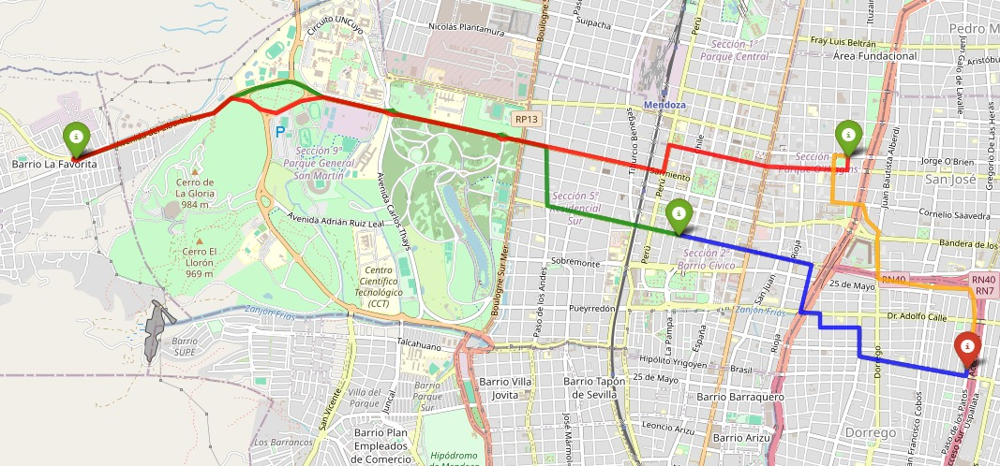

# logistics-graph-simulator

## Ejemplo de uso

### Paso 1

Ejecutar el archivo `export_data.py` cambiando `location` y `radius` por los valores deseados. `location` debe ser una dirección concreta, de lo contrario, `radius` no será tenido en cuenta y se creará un grafo que represente las calles de **toda** la ciudad indicada.

### Paso 2

Crear un archivo llamado `config.py` con la siguiente estructura:

```python
URI = "your_uri" # Default: bolt://localhost:7687
USER = "your_user" # Default: neo4j
PASSWORD = "your_password"
```

### Paso 3

Ejecutar Neo4j e importar los archivos CSV generados en el *Paso 1* utilizando `Script.cypher`.

### Paso 4

Ejecutar la siguiente consulta en Neo4j para guardar el grafo en memoria:

```sql
CALL gds.graph.project(
  'mapa-logistico',
  'Intersection',
  {
    STREET: {
      properties: ['length']
    }
  }
);
```

### Paso 5

Ejecutar `main.py`.

### Paso 6

Abrir `ruta_final_un_color.html` con su navegador de preferencia.

Ejemplo:

